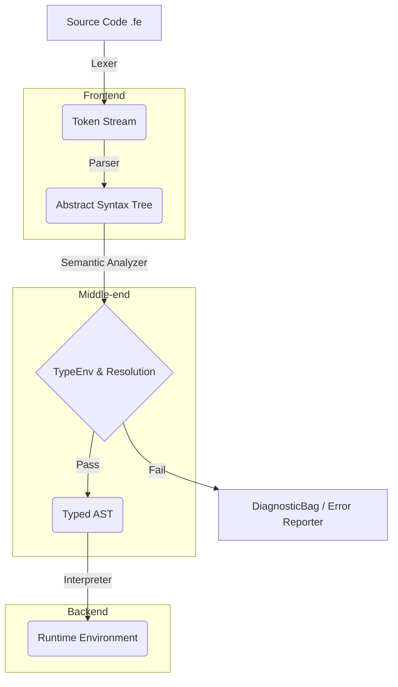

# Engineering Knowledge Base Index

## 1. Overview

The Ferrite Engineering Knowledge Base (EKB) serves as the canonical, single source of truth for the engineering architecture, internal design decisions, rationale, and evolution of the Ferrite compiler and language runtime.

Unlike the language specification documents (which define _what_ Ferrite is), this EKB explains _why_ and _how_ Ferrite is built. It captures the architectural trade-offs, constraints, memory models, parsing strategies, and algorithmic decisions made during development.

This documentation is written strictly for experienced software engineers, compiler developers, and core maintainers. It assumes fluency in systems programming (Rust), compiler theory (ASTs, parsing, semantic analysis, lowering), and intermediate representations.

## 2. Reading Order

For engineers onboarding to the Ferrite core team or attempting to rebuild the compiler, the documents must be read in the following sequence to map the data flow from parsing to execution:

### Phase I: Context & Requirements

1. `01_Project_Overview.md`
2. `02_Problem_Statement.md`
3. `03_Requirements.md`
4. `04_Version_History.md`

### Phase II: High-Level Architecture

5. `05_System_Architecture.md`
6. `06_Project_Structure.md`
7. `07_Language_Design.md`

### Phase III: The Compilation Pipeline

8. `08_Lexer.md`
9. `09_Parser.md`
10. `10_AST.md`
11. `11_Semantic_Analysis.md`

### Phase IV: Execution & Infrastructure

12. `12_Runtime.md`
13. `13_Error_Handling.md`
14. `14_Performance.md`
15. `15_Testing.md`

### Phase V: Evolution & Trade-offs

16. `16_Design_Decisions.md`
17. `17_Limitations.md`
18. `18_Future_Roadmap.md`
19. `19_Interview_Guide.md`
20. `99_Architect_Journal.md`

## 3. Cross-Reference Map

To avoid duplication, documents reference one another. Follow this map for contextual overlap:

- **Lexical/Grammar constraints** (`08_Lexer.md`, `09_Parser.md`) → **Language Spec** (`docs/grammar.ebnf`)
- **AST Design** (`10_AST.md`) → **Semantic Analysis** (`11_Semantic_Analysis.md`)
- **Type Checking** (`11_Semantic_Analysis.md`) → **Type System Spec** (`docs/type-system.md`)
- **Execution Model** (`12_Runtime.md`) → **Semantics Spec** (`docs/semantics.md`)
- **Architectural Debt** (`17_Limitations.md`) → **Future Work** (`18_Future_Roadmap.md`)

## 4. Glossary

- **EKB**: Engineering Knowledge Base.
- **TopDecl**: Top-level declaration in the AST (e.g., functions, groups, enums, imports).
- **Environment**: The runtime symbol table and call-stack memory space.
- **TypeEnv**: The semantic analysis symbol table storing type constraints and resolved symbols.
- **Module Exports**: The hash map mapping module paths to their public AST declarations.
- **Lowering**: The process of transforming high-level AST constructs into executable runtime values or bytecode.
- **DiagnosticBag**: The central error-reporting struct that accumulates lexical, parsing, and semantic errors without immediately halting compilation.

## 5. Architecture Map

## 6. Documentation Dependencies

This EKB does not duplicate language specifications. It explicitly depends on the following authoritative documents located in the `docs/` directory:

- `docs/grammar.ebnf`: Canonical grammar definitions.
- `docs/syntax.md`: Lexical and syntactic layout rules.
- `docs/semantics.md`: Operational semantics.
- `docs/type-system.md`: Type inference rules and traits constraints.
- `docs/standard-library.md`: Standard library APIs and underlying native bindings.

Always reference these external documents when reviewing parsing algorithms or type resolution logic.
