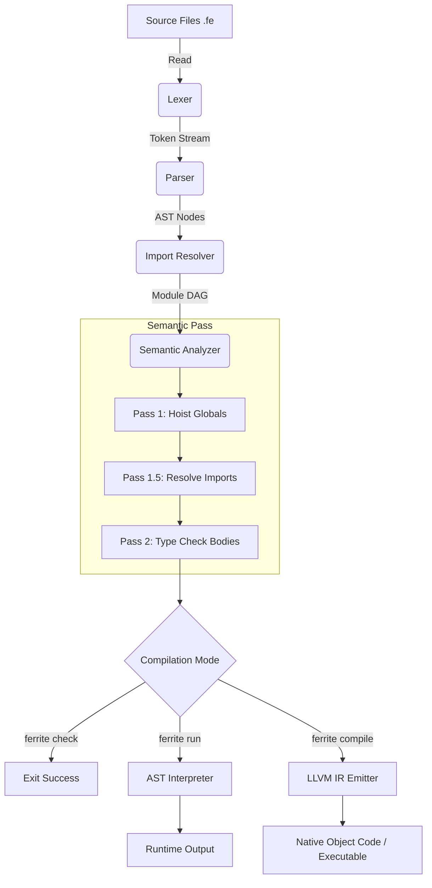

# System Architecture

## 1. Complete Architecture Overview

The Ferrite compiler is a multi-pass, ahead-of-time (AOT) compiler built entirely in Rust. Its architecture is strictly pipelined, separating the lexical/syntactic front-end from the semantic middle-end, and isolating execution environments (Tree-Walk Interpreter vs. LLVM Codegen) in the back-end.

The architecture is deliberately non-monolithic. The output of the parser (`AST`) is structurally decoupled from the semantic analyzer (`Typed AST` / `TypeEnv`), which is entirely agnostic to the target backend (LLVM IR vs WASM vs Native Runtime).

## 2. Layered Architecture

The compiler is divided into four distinct tiers:

### 2.1 The Front-End (Syntax)

- **Lexer (`src/lexer/`)**: Scans UTF-8 source code into a flat stream of heavily annotated Tokens. It handles identifier interning and token categorization (34 keywords, operators).
- **Parser (`src/parser/`)**: A hand-written, recursive-descent parser. It transforms the Token stream into an Abstract Syntax Tree (AST). It employs "panic-mode" error recovery, allowing it to synchronize at statement boundaries and continue parsing after encountering a syntax error, rather than crashing on the first missing semicolon.

### 2.2 The Middle-End (Semantics & Module Resolution)

- **Import Resolver (`src/imports/`)**: Traverses `import` statements recursively across files, detecting cyclic dependencies using a Directed Acyclic Graph (DAG) and caching parsed ASTs to avoid redundant disk I/O.
- **Type Environment (`src/types/`)**: Acts as the central registry. It manages the scoped symbol table, the unification engine for generic type inference, and registries for Traits, Enums, and Group Fields.
- **Semantic Analyzer (`src/semantic/`)**: The core of the compiler. It performs a multi-pass AST walk:
  - **Pass 1:** Hoists all global declarations (`fun`, `group`, `enum`, `constant`) into the `TypeEnv` to support unordered definitions.
  - **Pass 1.5:** Cross-references and resolves inter-module imports and `pub` visibility boundaries across all files in the DAG.
  - **Pass 2:** Deeply type-checks local expression bodies, function calls, and control flow, enforcing Ferrite's strict "zero implicit coercion" rules.

### 2.3 The Back-End (Execution)

- **Interpreter (`src/runtime/`)**: A pure-Rust AST-walking virtual machine. Primarily used for the `ferrite run` CLI command, the interactive REPL, and the WebAssembly (WASM) Playground. It is highly stateful, managing a lexical `Environment` stack and handling runtime memory limits.
- **LLVM Codegen (`src/codegen/llvm.rs`)**: A feature-gated module (using `inkwell` bindings) that lowers the `Typed AST` directly into highly optimized LLVM IR (Intermediate Representation) for native machine-code compilation.

### 2.4 The Diagnostic Subsystem

- **DiagnosticBag (`src/errors/`)**: A shared telemetry module passed through every tier of the compiler. It decouples error detection from error reporting. Lexical, Syntactic, and Semantic errors are aggregated into the bag alongside source code spans (line/column offsets) and emitted simultaneously at the end of compilation using ANSI-colored terminal output.

## 3. Execution Pipeline

## 4. Module Interaction and Data Flow

Data flows unidirectionally through the pipeline.

1. **Source → Tokens**: The lexer borrows the source code string (`&str`) to minimize allocations, emitting `Token` structs containing a `TokenKind` and a `Span`.
2. **Tokens → AST**: The Parser consumes tokens and builds a heap-allocated tree of `TopDecl` and `Stmt` nodes using `Box<T>`.
3. **AST → TypeEnv**: The Semantic Analyzer walks the `AST`, looking up and mutating state within the `TypeEnv`. The original AST is intentionally **not** mutated into a distinct `TypedAST` struct; instead, type metadata is side-loaded into the `TypeEnv` to reduce memory fragmentation and graph cloning.
4. **AST + TypeEnv → LLVM**: The backend code generator takes the read-only AST and the read-only `TypeEnv` and maps Ferrite types (`Type::Int`, `Type::Tensor`) to LLVM types (`i64`, `struct`), emitting LLVM instructions.

## 5. Architectural Decisions and Trade-offs

### 5.1 Hand-written Parser vs. Parser Generator (YACC/Bison)

**Decision:** We implemented a custom recursive-descent parser.
**Reasoning:** Parser generators yield terrible error messages (e.g., "Unexpected token"). A hand-written parser allows bespoke panic-mode recovery and precise contextual error hints (e.g., "Did you forget a semicolon after this statement?").
**Trade-off:** The parser (`parser/mod.rs`) is extremely verbose (~1500 lines) and requires manual maintenance whenever the grammar changes.

### 5.2 AST Side-Loading vs. AST Transformation

**Decision:** The Semantic Analyzer does not transform the `AST` into a new `TypedAST` struct. It maps node IDs to types in the `TypeEnv`.
**Reasoning:** In Rust, transforming a massive nested graph of `Box<AST>` requires deep cloning and complex lifetime management. Keeping the AST read-only after parsing and storing side-effects in a separate Hash Map (`TypeEnv`) drastically improves compiler throughput.
**Trade-off:** Backends (Interpreter/LLVM) must constantly query the `TypeEnv` during execution/lowering, incurring a slight hash-lookup penalty compared to direct pointer dereferencing.

### 5.3 Modular Feature Gating (`cfg(feature = "llvm")`)

**Decision:** LLVM dependencies are optional and disabled by default.
**Reasoning:** The `inkwell` and `llvm-sys` crates are notoriously difficult to compile on Windows and CI environments without massive external C++ toolchains. By feature-gating LLVM, the core compiler (Lexer, Parser, Semantic Analyzer, Interpreter) can compile natively to WASM or run via `cargo run` in less than 3 seconds on any machine.
